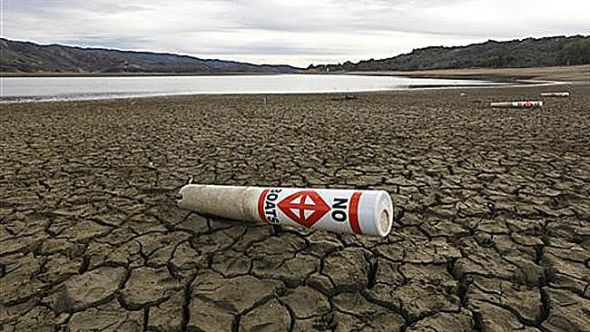

#Climate Research on Month or Year
```{r clim, eval=TRUE, echo=TRUE, warning=FALSE}

clim=read.table("clim.txt", header = TRUE)

# Monthly Average Temperature Boxplot
View(clim)
Aggdat <- aggregate(clim,by=list(clim$month,clim$year),FUN="mean")
Aggdat$mean <- (Aggdat$tmin+Aggdat$tmax)/2

boxplot(Aggdat$mean~Aggdat$month,
  ylab="Average Temperature from 1942 to 2016",
  xlab="Month", col="orange")

# Monthly Precipitation Boxplot 
clim2 <- clim[,2:7]
Agg2 <- aggregate(clim2, by=list(clim2$month,clim2$year), FUN="sum")

boxplot(Agg2$rain~Aggdat$month,
  ylab="Precipitation from 1942 to 2016",
  xlab="Month", col="blue")

# Aggregate precipitation by year
Agg3<- aggregate(clim2, by=list(clim2$year), FUN="sum")

#Wettest Year
wettest=which.max(Agg3$rain)
Agg3[wettest,]
Agg3[wettest,c("Group.1","rain")]
Agg3$year=as.integer(Agg3$Group.1)
Agg3$rain=as.integer(Agg3$rain)
Agg3[wettest,c("year","rain")]

#Driest Year
driest=which.min(Agg3$rain)
Agg3[driest,]
Agg3[driest,c("Group.1","rain")]
Agg3$year=as.integer(Agg3$Group.1)
Agg3$rain=as.integer(Agg3$rain)
Agg3[driest,c("year","rain")]


```

## Scenery in Wet Year
<div align="center">

</div>


## Scenery in dry year
<div align="center">

</div>
```

#Climate Research on Season
```{r eval=TRUE, echo=TRUE, warning=FALSE}
#Season
clim2$Season <- ifelse(clim2$month <= 5 & clim2$month >= 3, 1, ifelse(clim2$month <= 8, 2,(ifelse(clim2$month <= 11, 3, 4))))

#Wettest Season
Agg4<- aggregate(clim2,by=list(clim2$Season,clim2$year),FUN="sum")

wet=which.max(Agg4$rain)
Agg4[wet,]
Agg4[wet,c("Group.1","Group.2","rain")]
Agg4$Season=as.integer(Agg4$Group.1)
Agg4$year=as.integer(Agg4$Group.2)
Agg4$rain=as.integer(Agg4$rain)
Agg4[wet,c("Season","year","rain")]

#Driest Year
dry=which.min(Agg4$rain)
Agg4[dry,]
Agg4[dry,c("Group.1","Group.2","rain")]
Agg4$Season=as.integer(Agg4$Group.1)
Agg4$year=as.integer(Agg4$Group.2)
Agg4$rain=as.integer(Agg4$rain)
Agg4[dry,c("Season","year","rain")]

## Relationship between Precipitation and Temperature 
Agg5 <- aggregate(clim2, by=list(clim2$Season, clim2$year), FUN="mean")
Agg5$Temperature <- (Agg5$tmax + Agg5$tmin)/2
SummerT <- subset(Agg5, Season == 2)
ST <- SummerT[,c(2,10)]
colnames(ST) <- c("Year", "Temperature")
WinterP <- subset(Agg5, Season == 4)
WP <- WinterP[,c(2,5)]
colnames(WP) <- c("Year", "Precipitation")
Relation <- merge(ST, WP,by="Year")

library(ggplot2)
ggplot(Relation, aes(Temperature, Precipitation))+
  geom_point(size=1, aes(color=Temperature))+
  xlab("Temperature")+
  ylab("Precipitation")+
  ggtitle("Relationship between Winter Precipitation and Summer Temperature \n1942-2016")+
  theme_bw()+
  theme(text=element_text(family="Times", size=14),panel.grid.major=element_blank(),panel.grid.minor=element_blank(), axis.title.x=element_text(size=12), axis.title.y=element_text(size=12))+
   theme(legend.position=c(0.1,0.7),legend.box=NULL, legend.key=element_blank(), legend.text=element_text(size=9), legend.title=element_blank())

#Figure Comment 
#Graph shows that there is not too obvious relation between winter precipitation and summer temperature. However, we still can notice that some of low summer temperature leads to high precipitation in winter, whihle more high temperature contributes to low precipitation. Better understand this relationship between summer temperature and winter precipitation can help scientist forecast climte and response to the unexpected climate change.


```
